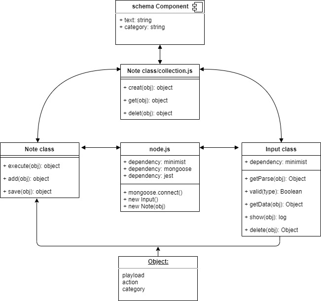

# notes
How do I install the app or library?

How do I test the app or library?
`$npm test` 

For Applications:

How do I run the app?
you can add notes by CLI as following:
1. to add: `$./notes.js a- <The note that you want to insert> --category <category>`
2. to delete: `$./notes.js delete <_id of the note>
3. to display the list: -`$./notes.js --list <category>`
    for all lists--->   - `$./notes.js --list

How do I set up the app?

UML
